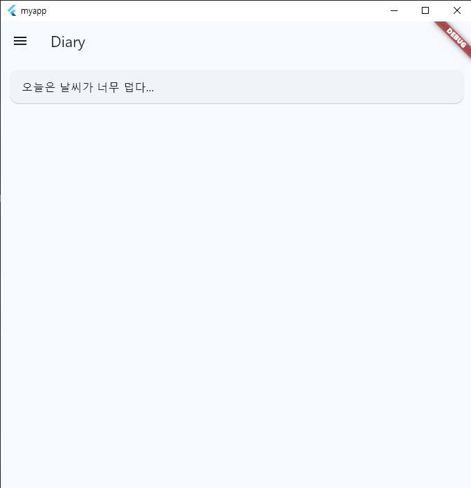

# main.dart
  
```dart
import 'package:flutter/material.dart';
import 'package:provider/provider.dart';
import 'pages/home_page.dart';
import 'routes.dart';

void main() {
  runApp(MyApp());
}

class MyApp extends StatelessWidget {
  @override
  Widget build(BuildContext context){
    return MultiProvider(
      providers: [
        ChangeNotifierProvider<MyAppState>(create: (context) => MyAppState()),
        ChangeNotifierProvider<DiaryState>(create: (context) => DiaryState()),
      ],
      child: MaterialApp(
        title: 'My Diary',
        theme: ThemeData(
          useMaterial3: true,
          colorScheme: ColorScheme.fromSeed(seedColor: Colors.lightBlueAccent),
        ),
        initialRoute: RoutePage.home,
        routes: RoutePage.appRoutes,
      ),
    );
  }
}

class MyAppState extends ChangeNotifier {
  int selectedIndex = 0;

  void updateIndex(int index) {
    selectedIndex = index;
    notifyListeners();
  }
}
```  
  
## App 진입점 >> 애플리케이션 실행
  
```dart
void main() {
  runApp(MyApp()); // 구동 함수
}
```
  
## MyApp Class
  
```dart
class MyApp extends StatelessWidget {
  @override
  Widget build(BuildContext context){
    return MultiProvider(
      providers: [
        ChangeNotifierProvider<MyAppState>(create: (context) => MyAppState()),
        ChangeNotifierProvider<DiaryState>(create: (context) => DiaryState()),
      ],
      child: MaterialApp(
        title: 'My Diary',
        theme: ThemeData(
          useMaterial3: true,
          colorScheme: ColorScheme.fromSeed(seedColor: Colors.lightBlueAccent),
        ),
        initialRoute: RoutePage.home,
        routes: RoutePage.appRoutes,
      ),
    );
  }
}
```
  
main 메서드에서 구동시키는 애플리케이션 클래스  
|제목|내용|설명|
|------|---|---|
|provider|
ChangeNotifierProvider<MyAppState>(create: (context) => MyAppState()),
ChangeNotifierProvider<DiaryState>(create: (context) => DiaryState()),
|애플리케이션의 상태(State)를 관리하기 위한 라이브러리, 연결된 클래스들(위젯)의 상태가 변하는 것을 감지(감시)|
|MaterialApp|MaterialApp(
title: 'My Diary',
theme: ThemeData(
useMaterial3: true,
colorScheme: ColorScheme.fromSeed(seedColor: Colors.lightBlueAccent),
)|이 애플리케이션의 최상위를 의미|
|Routing|initialRoute: RoutePage.home,
routes: RoutePage.appRoutes,|페이지 이동을 위한 라우팅|  
  
## MyAppState Class

```dart
class MyAppState extends ChangeNotifier {
  int selectedIndex = 0;

  void updateIndex(int index) {
    selectedIndex = index;
    notifyListeners();
  }
}
```
menu 탭의 메뉴 선택 상태를 반영하기 위한 상태 관리 클래스  
notifyListeners() : 내부적으로 변수 같은 값이 변했을 때 위젯 재빌드를 위한 메서드, Provider에서 제공  

  
# routes.dart
```dart
import 'package:flutter/material.dart';
import 'pages/home_page.dart';
import 'pages/diary_page.dart';

class RoutePage {
  static const String home = '/';
  static const String diary = '/diary';

  static final Map<String, WidgetBuilder> appRoutes = {
    home: (context) => HomePage(),
    diary: (context) => DiaryPage(),
  };
}
```  
페이지 이동(Routing)을 위한 클래스  

# home_page.dart
```dart
import 'package:flutter/material.dart';
import '/widgets/drawer_widget.dart';
import 'package:provider/provider.dart';

class HomePage extends StatelessWidget {
  @override
  Widget build(BuildContext context) {
    return Scaffold(
      appBar: AppBar(title: Text("Home")),
      drawer: MainDrawer(),
      body: Center(
          child: InsertDiary()
      ),
    );
  }
}

class DiaryState extends ChangeNotifier {
  final TextEditingController _controller = TextEditingController();
  TextEditingController get controller => _controller; // getter
  var diaryContents = <String>[];

  @override
  void dispose() {
    _controller.dispose();
    super.dispose();
  }

  void insertContent(String content) {
    if (diaryContents.contains(content)){
      return;
    }
    diaryContents.add(content);
    notifyListeners();
  }

  void writeDiary() {
    String content = _controller.text;
    insertContent(content);
    _controller.clear();
  }
}

class InsertDiary extends StatefulWidget {
  @override
  State<InsertDiary> createState() => InsertDiaryState();
}

class InsertDiaryState extends State<InsertDiary> {
  @override
  Widget build(BuildContext context) {
    final diaryState = Provider.of<DiaryState>(context);
    return Column(
      mainAxisSize: MainAxisSize.min,
      children: [
        SizedBox(
          width: 500,
          child: Container(
            child: TextField(
              controller: diaryState.controller,
              decoration: InputDecoration(
                label: Center(
                  child: Text(
                    '간단한 한 줄 일기',
                    textAlign: TextAlign.center,
                  )
                ),
                border: OutlineInputBorder(borderRadius: BorderRadius.horizontal())
              )
            ),
          ),
        ),
        SizedBox(
          height: 15,
        ),
        ElevatedButton(
              onPressed: () {
                diaryState.writeDiary();
              },
              child: Text('작성')
          )
      ],
    );
  }
}
```  
메인 홈이 되는 위젯  
한 줄 일기를 작성하고 내용을 리스트에 담아 관리  
  


# diary_page.dart
```dart
import 'package:flutter/material.dart';
import '/widgets/drawer_widget.dart';
import 'package:provider/provider.dart';
import '/pages/home_page.dart';

class DiaryPage extends StatelessWidget {
  @override
  Widget build(BuildContext context) {
    return Scaffold(
      appBar: AppBar(title: Text("Diary")),
      drawer: MainDrawer(),
      body: DiaryList(),
    );
  }
}

class DiaryList extends StatelessWidget{
  @override
  Widget build(BuildContext context) {
    final diaryState = Provider.of<DiaryState>(context);

    return ListView.builder(
      padding: EdgeInsets.all(10),
      itemCount: diaryState.diaryContents.length,
      itemBuilder: (context, index) {
        final content = diaryState.diaryContents[index];
        return Card(
          child: ListTile(title: Text(content)),
        );
      },
    );
  }
}
```  

내가 쓴 일기 목록을 확인할 수 있는 위젯  
  

  
# drawer_widget.dart
  
```dart
import 'package:flutter/material.dart';
import 'package:provider/provider.dart';
import '/main.dart';
import '/routes.dart';

class MainDrawer extends StatelessWidget {
  @override
  Widget build(BuildContext context) {
    final appState = Provider.of<MyAppState>(context);

    return Drawer(
      child: ListView(
        padding: EdgeInsets.zero,
        children: [
          const DrawerHeader(
            decoration: BoxDecoration(color: Colors.lightBlue),
            child: Text('My Diary App', style: TextStyle(color: Colors.white, fontSize: 24)),
          ),
          ListTile(
            leading: Icon(Icons.home),
            title: Text('Home'),
            selected: appState.selectedIndex == 0,
            onTap: () {
              appState.updateIndex(0);
              Navigator.pushReplacementNamed(context, RoutePage.home);
            },
          ),
          ListTile(
            leading: Icon(Icons.auto_stories_outlined),
            title: Text('Diary'),
            selected: appState.selectedIndex == 1,
            onTap: () {
              appState.updateIndex(1);
              Navigator.pushReplacementNamed(context, RoutePage.diary);
            },
          ),
        ],
      )
    );
  }
}

```  
탭 메뉴 위젯